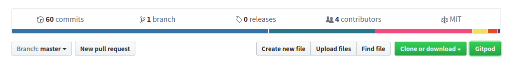
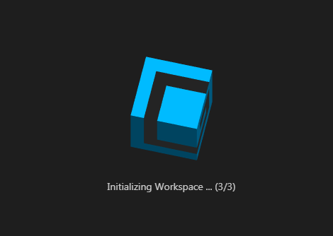
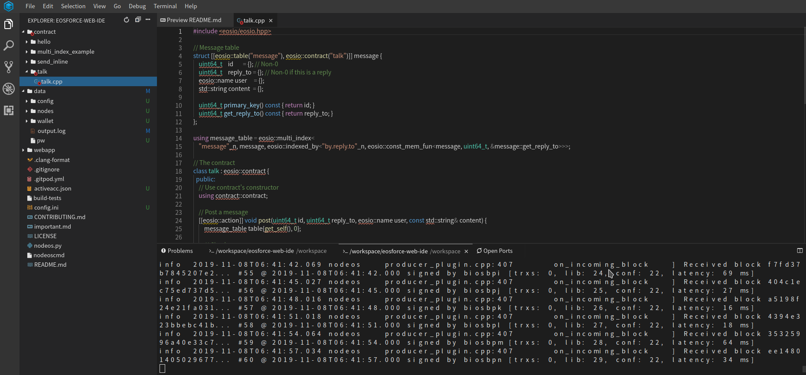
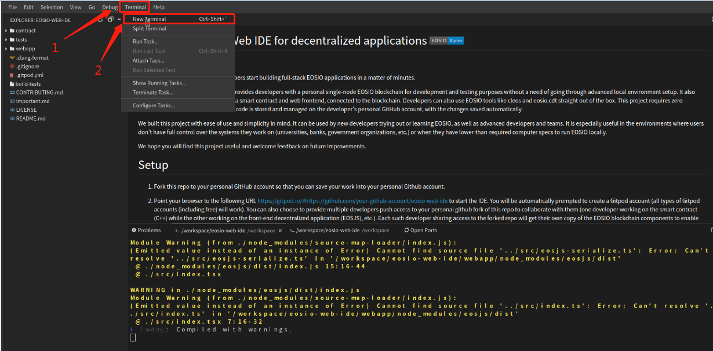
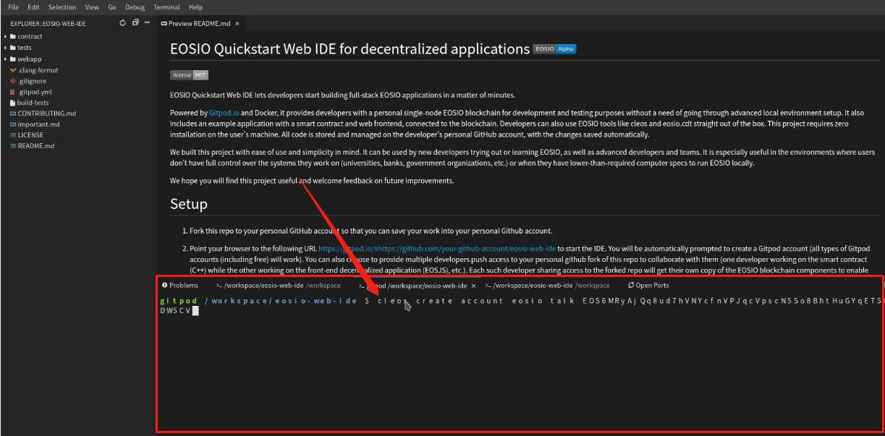

# eosforce使用Web IDE调试智能合约

## Web IDE是什么？

各位小伙伴对IDE肯定不陌生，主要是用于提供程序开发环境的应用程序，一般包括代码编辑器、编译器、调试器和图形用户界面等工具。

web IDE则是将IDE里面除用户交互之外的功能全部移到了后台，开发人员在浏览器上可以像在本机一样调试、编译、运行程序，并且不会受系统环境和机器性能的限制。


（图为一款web IDE的系统架构）

目前的web IDE主要有AWS Cloud9、Cloud Studio、Eclipse Che、Gitpod等，这些web IDE各有千秋，其中Gitpod是目前web IDE中对Github上的项目支持最好的，也是eosforce主推的一款产品。并且Gitpod对于非商用的开发者，每月会有100小时的免费使用时间，本文的讲解，也会以Gitpod为例（下文中提到的web IDE，在没有特指的情况下，全部为Gitpod）

关于Gitpod，可以参考[Gitpod说明文档](https://www.gitpod.io/docs/)

## 为什么要使用Web IDE

### 1. 环境搭建及运行节点门槛
对于很多区块链爱好者来说，想要搭建一个简单的环境来了解一个区块链项目，很大程度上会因为搭建环境以及初次运行过程中的各种问题而退缩。

对于智能合约开发者来说，很多时候会因为初次运行，或者环境切换等原因，在这个过程中耗费很多不必要的时间成本。

而Web IDE的出现，会让这些问题不再成为麻烦。拿eosforce来说，想要启动一个节点，并且在节点上部署开发好的智能合约，并不是一件很简单的事，需要下载代码、安装依赖、编译代码、启动节点、编译合约、然后部署。在这个过程中，可能会出现非常多的问题，而使用web IDE，只需要一键，就可以开始开发调试智能合约，非常方便。

### 2. 启动节点的机器性能要求

在计算机上运行一个eosforce的节点，是非常耗费性能的，很多PC机可能根本没法成功运行一个eosforce的节点，更不用说同时还打开IDE调试智能合约，而Web IDE将这些对机器性能的要求移到了后台，前端仅仅是一个交互页面。

### 3. 随处可用

传统IDE还有一个问题就是每次开发必须带上开发机或者每次改完代码都push到远程，而Web IDE解决了这个问题，它可以随时在远程保留开发环境，随时随地，只要有浏览器，就可以开始写合约。

## 使用步骤

### 1. 浏览器插件下载(由于众所周知的原因，这一步需要一些方法才可以执行成功，也可以直接跳过这一步，不安装gitpod插件)

Gitpod对Chrome和Firefox都提供了插件支持，下载插件后，会使进入Gitpod开始开发更加方便，本文以Chrome为例介绍使用步骤。

[Chrome插件下载](https://chrome.google.com/webstore/detail/gitpod-online-ide/dodmmooeoklaejobgleioelladacbeki)

### 2. 一键生成环境

插件下载成功后，打开eosforce专门为使用web IDE开发智能合约准备的github项目[https://github.com/ylic/eosforce-web-ide](https://github.com/ylic/eosforce-web-ide), 然后点右上角的 Fork 按扭，Fork项目代码到你自己的仓库，如 https://github.com/eosforce/eosforce-web-ide

我们会发现项目的主页上多了一个Gitpod按钮



点击Gitpod按钮，就可以直接进到一个节点已经启动好的环境中，并且这个环境提供了一些编写智能合约的模板。

如果没有安装GitPod插件，可以直接在浏览器上新开一个页面，输入网址 https://gitpod.io/#https://github.com/xxxxx/eosforce-web-ide (其它xxxx替换成你的github用户名)



网页开始加载开发环境，第一次加载会比较慢，请稍等几分钟。



从图中可以看见，eosforce已经模拟正式环境启动了23个节点并且正在出块，同时整个编写智能合约的IDE环境已经搭建好，现在就可以使用web IDE直接开始开发智能合约了。

### 3. 开发调试合约

智能合约的具体开发、调试以及部署说明可以参考[eosio白皮书](https://github.com/EOSIO/Documentation/blob/master/TechnicalWhitePaper.md)，本文仅分析该项目模板合约的部署和调用

* 在web IDE中打开`contract/talk/talk.cpp`文件，核心逻辑如下：
```
[[eosio::action]] void post(uint64_t id, uint64_t reply_to, eosio::name user, const std::string& content) {
        message_table table{get_self(), 0};

        require_auth(user);   // 检查用户

        if (reply_to)                   // 检查是否需要回复
            table.get(reply_to);

        // 检查id不能过大，并且当没有传的时候分配一个id
        eosio::check(id < 1'000'000'000ull, "user-specified id is too big");
        if (!id)
            id = std::max(table.available_primary_key(), 1'000'000'000ull);

        // 记录post的内容到table
        table.emplace(get_self(), [&](auto& message) {
            message.id       = id;
            message.reply_to = reply_to;
            message.user     = user;
            message.content  = content;
        });
    }
```

* 理清post方法的逻辑之后，就可以开始编译文件了，首先点击Gitpod上方导航栏的Terminal -> New Terminal(如下图)



可以看见Gitpod下方出现了一个新的命令行窗口



* 在该窗口执行如下命令，编译talk.cpp文件，会生成`talk.abi`和`talk.wasm`两个文件
```shell
gitpod /workspace/eosforce-web-ide $ cd contract/talk
gitpod /workspace/eosforce-web-ide $
gitpod /workspace/eosforce-web-ide/contract/talk $ ll
total 12
drwxr-xr-x 2 gitpod gitpod 4096 Nov  8 08:13 ./
drwxr-xr-x 6 gitpod gitpod 4096 Nov  8 08:13 ../
-rw-r--r-- 1 gitpod gitpod 1477 Nov  8 08:13 talk.cpp
gitpod /workspace/eosforce-web-ide/contract/talk $
gitpod /workspace/eosforce-web-ide/contract/talk $
gitpod /workspace/eosforce-web-ide/contract/talk $ eosforce-cpp talk.cpp -o talk.wasm
Warning, empty ricardian clause file
Warning, empty ricardian clause file
Warning, action <post> does not have a ricardian contract
gitpod /workspace/eosforce-web-ide/contract/talk $
gitpod /workspace/eosforce-web-ide/contract/talk $
gitpod /workspace/eosforce-web-ide/contract/talk $ ll
total 24
drwxr-xr-x 2 gitpod gitpod 4096 Nov  8 08:15 ./
drwxr-xr-x 6 gitpod gitpod 4096 Nov  8 08:13 ../
-rw-r--r-- 1 gitpod gitpod 1646 Nov  8 08:15 talk.abi
-rw-r--r-- 1 gitpod gitpod 1477 Nov  8 08:13 talk.cpp
-rwxr-xr-x 1 gitpod gitpod 7936 Nov  8 08:15 talk.wasm*
```
* 然后执行以下命令，创建合约账户talk，并向该合约账户转帐10000EOS(此次转账主要是该账户随后需要set code和set abi)
```shell
gitpod /workspace/eosforce-web-ide/contract/talk $ cleos create account eosforce talk EOS6MRyAjQq8ud7hVNYcfnVPJqcVpscN5So8BhtHuGYqET5GDW5CV
executed transaction: 9ffe7d6668131c373d7de620448f10cea0d11ceb664d1a144154f56237b08492  216 bytes  1879 us
#         eosio <= eosio::onfee                 {"actor":"eosforce","fee":"0.1000 EOS","bpname":""}
#         eosio <= eosio::newaccount            {"creator":"eosforce","name":"talk","owner":{"threshold":1,"keys":[{"key":"EOS6MRyAjQq8ud7hVNYcfnVPJ...
warning: transaction executed locally, but may not be confirmed by the network yet         ] 
gitpod /workspace/eosforce-web-ide/contract/talk $
gitpod /workspace/eosforce-web-ide/contract/talk $
gitpod /workspace/eosforce-web-ide/contract/talk $ cleos transfer eosforce talk '10000.0000 EOS'
executed transaction: ad36717e51a2fea17f2707f4f6e1eaabf6fefe50d5298439cbaf502c595ad964  144 bytes  599 us
#         eosio <= eosio::onfee                 {"actor":"eosforce","fee":"0.0100 EOS","bpname":""}
#         eosio <= eosio::transfer              {"from":"eosforce","to":"talk","quantity":"10000.0000 EOS","memo":""}
#      eosforce <= eosio::transfer              {"from":"eosforce","to":"talk","quantity":"10000.0000 EOS","memo":""}
#          talk <= eosio::transfer              {"from":"eosforce","to":"talk","quantity":"10000.0000 EOS","memo":""}
warning: transaction executed locally, but may not be confirmed by the network yet         ] 
```
* 通过执行系统合约为talk账户租一定的内存(此处需要多租一点，因为set code操作需要的内存很多)，然后将编译后的wasm和abi文件绑定到talk合约账户
```shell
gitpod /workspace/eosforce-web-ide/contract/talk $ cleos push action eosio vote4ram  '[talk, biosbpa, "2000.0000 EOS"]' -p talk
executed transaction: 001670d6b4786e99391b0f21b059b8c634060ed92fccd982b5e2969ddeb85f82  144 bytes  1916 us
#         eosio <= eosio::onfee                 {"actor":"talk","fee":"0.0500 EOS","bpname":""}
#         eosio <= eosio::vote4ram              {"voter":"talk","bpname":"biosbpa","stake":"2000.0000 EOS"}
warning: transaction executed locally, but may not be confirmed by the network yet         ] 
gitpod /workspace/eosforce-web-ide/contract/talk $
gitpod /workspace/eosforce-web-ide/contract/talk $
gitpod /workspace/eosforce-web-ide/contract/talk $ cleos set code talk talk.wasm
Reading WASM from /workspace/eosforce-web-ide/contract/talk/talk.wasm...
Setting Code...
executed transaction: c0fc90d57671463483ac249270c44bb52b622b6766e87cb11b0c194e22db74e6  4040 bytes  8473 us
#         eosio <= eosio::onfee                 {"actor":"talk","fee":"0.1000 EOS","bpname":""}
#         eosio <= eosio::setcode               {"account":"talk","vmtype":0,"vmversion":0,"code":"0061736d0100000001a2011a6000006000017f60027f7f006...
warning: transaction executed locally, but may not be confirmed by the network yet         ] 
gitpod /workspace/eosforce-web-ide/contract/talk $
gitpod /workspace/eosforce-web-ide/contract/talk $
gitpod /workspace/eosforce-web-ide/contract/talk $ cleos set abi talk talk.abi
Setting ABI...
executed transaction: 8ae2d2ced099ce4d3f025366eacd8146bb85ba23e032f7bef75d47bfdc0135f2  208 bytes  524 us
#         eosio <= eosio::onfee                 {"actor":"talk","fee":"0.1000 EOS","bpname":""}
#         eosio <= eosio::setabi                {"account":"talk","abi":"0e656f73696f3a3a6162692f312e310002076d65737361676500040269640675696e7436340...
warning: transaction executed locally, but may not be confirmed by the network yet         ] 

```
* 为talk合约账户的post方法设置fee，此处是其他账户执行该方法时需要支付的fee
```shell
gitpod /workspace/eosforce-web-ide/contract/talk $ cleos set setfee talk post '1.0000 EOS'
debug 2019-11-08T08:20:13.251 cleos     cmds.hpp:187                  operator()           ] set fee post, 1.0000 EOS
executed transaction: eedd5243217fd2e90603c51c1cf485b76028ca2d9086ecc5d32f594d64d783e5  152 bytes  437 us
#         eosio <= eosio::onfee                 {"actor":"talk","fee":"0.1000 EOS","bpname":""}
#         eosio <= eosio::setfee                {"account":"talk","action":"post","fee":"1.0000 EOS","cpu_limit":0,"net_limit":0,"ram_limit":0}
warning: transaction executed locally, but may not be confirmed by the network yet         ] 
```
* 随后创建两个普通账户bob和alice，并向他们每人转帐100 EOS(因为后续执行合约需要扣除fee)，用来执行合约
```shell
gitpod /workspace/eosforce-web-ide/contract/talk $ cleos create account eosforce bob EOS6MRyAjQq8ud7hVNYcfnVPJqcVpscN5So8BhtHuGYqET5GDW5CV
executed transaction: ca76dc207b2e9f0805658eb40e81adb6e5637037cb9c0f042b26cebfc23d9abb  216 bytes  2450 us
#         eosio <= eosio::onfee                 {"actor":"eosforce","fee":"0.1000 EOS","bpname":""}
#         eosio <= eosio::newaccount            {"creator":"eosforce","name":"bob","owner":{"threshold":1,"keys":[{"key":"EOS6MRyAjQq8ud7hVNYcfnVPJq...
warning: transaction executed locally, but may not be confirmed by the network yet         ] 
gitpod /workspace/eosforce-web-ide/contract/talk $
gitpod /workspace/eosforce-web-ide/contract/talk $
gitpod /workspace/eosforce-web-ide/contract/talk $ cleos create account eosforce jane EOS6MRyAjQq8ud7hVNYcfnVPJqcVpscN5So8BhtHuGYqET5GDW5CV
executed transaction: 9cba53d3d1b1f084af3cca3405e09950b8017c0aa86b169715f8eaf3094db1b4  216 bytes  12916 us
#         eosio <= eosio::onfee                 {"actor":"eosforce","fee":"0.1000 EOS","bpname":""}
#         eosio <= eosio::newaccount            {"creator":"eosforce","name":"jane","owner":{"threshold":1,"keys":[{"key":"EOS6MRyAjQq8ud7hVNYcfnVPJ...
warning: transaction executed locally, but may not be confirmed by the network yet         ] 
gitpod /workspace/eosforce-web-ide/contract/talk $
gitpod /workspace/eosforce-web-ide/contract/talk $
gitpod /workspace/eosforce-web-ide/contract/talk $ cleos transfer  eosforce bob '100 EOS'
executed transaction: 4eec5f55cc9cd88fe45a7f3f96e5346cc0fa00f7ce921a0329eb72077eb89f3d  144 bytes  3527 us
#         eosio <= eosio::onfee                 {"actor":"eosforce","fee":"0.0100 EOS","bpname":""}
#         eosio <= eosio::transfer              {"from":"eosforce","to":"bob","quantity":"100.0000 EOS","memo":""}
#      eosforce <= eosio::transfer              {"from":"eosforce","to":"bob","quantity":"100.0000 EOS","memo":""}
#           bob <= eosio::transfer              {"from":"eosforce","to":"bob","quantity":"100.0000 EOS","memo":""}
warning: transaction executed locally, but may not be confirmed by the network yet         ] 
gitpod /workspace/eosforce-web-ide/contract/talk $
gitpod /workspace/eosforce-web-ide/contract/talk $
gitpod /workspace/eosforce-web-ide/contract/talk $ cleos transfer  eosforce jane '100 EOS'
executed transaction: 7e7b763f9a4f68afd7d01484a412248383e11caa4dcb62d972f207de04520271  144 bytes  5831 us
#         eosio <= eosio::onfee                 {"actor":"eosforce","fee":"0.0100 EOS","bpname":""}
#         eosio <= eosio::transfer              {"from":"eosforce","to":"jane","quantity":"100.0000 EOS","memo":""}
#      eosforce <= eosio::transfer              {"from":"eosforce","to":"jane","quantity":"100.0000 EOS","memo":""}
#          jane <= eosio::transfer              {"from":"eosforce","to":"jane","quantity":"100.0000 EOS","memo":""}
warning: transaction executed locally, but may not be confirmed by the network yet         ] 
```

* 执行合约，以下三个命令分别是
   * bob以1000为id，发布一条"This is a new post"消息到table，并且不需要回复
   * jane以2000为id，发布一条"This is my first post"消息到table，并且不需要回复
   * bob以1001为id，发布一条"Replying to your post"消息到table，并且回复jane
```shell
gitpod /workspace/eosforce-web-ide/contract/talk $ cleos push action talk post '[1000, 0, bob, "This is a new post"]' -p bob
executed transaction: 334cd00bde35481b14b8bc68598dc4919b817d60cc3aa3be74e3b837520e8d90  152 bytes  11106 us
#         eosio <= eosio::onfee                 {"actor":"bob","fee":"1.0000 EOS","bpname":""}
#          talk <= talk::post                   {"id":1000,"reply_to":0,"user":"bob","content":"This is a new post"}
warning: transaction executed locally, but may not be confirmed by the network yet         ] 
gitpod /workspace/eosforce-web-ide/contract/talk $
gitpod /workspace/eosforce-web-ide/contract/talk $
gitpod /workspace/eosforce-web-ide/contract/talk $ cleos push action talk post '[2000, 0, jane, "This is my first post"]' -p jane
executed transaction: 249f934322074d5f1572ad32430284fe5fed88c29fd46afaae448c61a0a4e460  160 bytes  474 us
#         eosio <= eosio::onfee                 {"actor":"jane","fee":"1.0000 EOS","bpname":""}
#          talk <= talk::post                   {"id":2000,"reply_to":0,"user":"jane","content":"This is my first post"}
warning: transaction executed locally, but may not be confirmed by the network yet         ]
gitpod /workspace/eosforce-web-ide/contract/talk $
gitpod /workspace/eosforce-web-ide/contract/talk $
gitpod /workspace/eosforce-web-ide/contract/talk $ cleos push action talk post '[1001, 2000, bob, "Replying to your post"]' -p bob
executed transaction: 22ec3a13ca070d1114d4626c6675f3fbf22a8d059090046fb0c0608d1e389a4e  160 bytes  735 us
#         eosio <= eosio::onfee                 {"actor":"bob","fee":"1.0000 EOS","bpname":""}
#          talk <= talk::post                   {"id":1001,"reply_to":2000,"user":"bob","content":"Replying to your post"}
warning: transaction executed locally, but may not be confirmed by the network yet         ] 
```
* 最后，输入如下命令，查看table的内容
```shell
gitpod /workspace/eosforce-web-ide/contract/talk $ cleos get table talk '' message
```
得到如下结果，说明合约已经成功执行
```shell
{
  "rows": [{
      "id": 1000,
      "reply_to": 0,
      "user": "bob",
      "content": "This is a new post"
    },{
      "id": 1001,
      "reply_to": 2000,
      "user": "bob",
      "content": "Replying to your post"
    },{
      "id": 2000,
      "reply_to": 0,
      "user": "jane",
      "content": "This is my first post"
    }
  ],
  "more": false
}
```

### 4. 过程分析

下面具体分析一下这个一键生成环境的过程中都发生了什么

* 在任何一个github项目的地址前，加上https://gitpod.io/# ， 就可以在gitpod中打开该项目，例如在eosforce-web-ide这个项目中点击Gitpod按钮，实际访问的就是https://gitpod.io/#https://github.com/ylic/eosforce-web-ide 这个地址
* 打开Gitpod之后，Gitpod会根据项目中的 `.gitpod.yml` 文件来决定环境的初始化工作，该文件内容如下：
     
```
image: ylic/eosforce-web-ide:v0.1.0    # Gitpod会加载ylic/eosforce-web-ide:v0.1.0的docker镜像，该镜像里面会部署编译好的eosforce相关程序，以及其他一些需要使用到的文件

ports:                               # 配置环境中需要打开的端口
- port: 3000
  onOpen: ignore
- port: 8000
  onOpen: ignore
- port: 8080
  onOpen: ignore
- port: 8888
  onOpen: ignore
- port: 9876
  onOpen: ignore
  ...    #此处省略了部分端口

tasks:                        # 初始化阶段的任务

- before: cd webapp
  init: yarn　　　　# yarn会根据package.json文件去下载相关依赖包
  command: nginx -c $PWD/nginx.conf; npx webpack-dev-server     # 启动nginx反向代理
- before: cd /workspace/eosforce-web-ide
  command: ./nodeoscmd     # 启动nodeos
  ```

* 以上步骤结束后，一个完整的eosforce测试环境就运行起来了，然后IDE会加载当前项目，开发人员就可以通过浏览器开发调试智能合约了

## 总结

通过以上步骤，很大的简化了编写和调试智能合约的难度，使得更多的开发者可以接触到这个优秀的区块链项目和智能合约。同时，有了这些web IDE的相关指导文档，越来越多的开源团队也可以发布自己基于web IDE项目，来方便开发者更好的对开源社区作出贡献。

## 欢迎加入 EOSC开发交流学习群


无法进群的同学，请添加 原力队长  微信号:EOSforce


